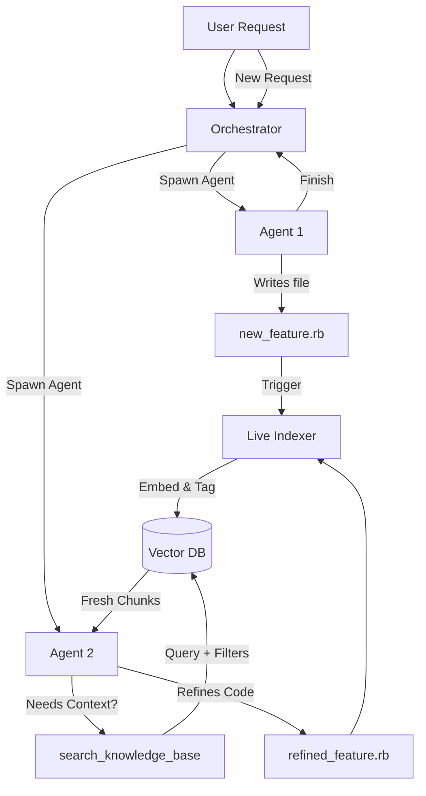

# Tau RAG Strategy: Live Indexing for Multi-Agent Evolution

## 🎯 Vision
A system where multiple small agents work in isolation, generate code/docs, and a **live RAG (Retrieval-Augmented Generation)** system ensures that fresh agents can instantly access the work of their predecessors without context bloat.

## 🏗️ Core Principles

### 1. Live Indexing (No Batching)
- **Rule**: Every file write triggers an immediate, lightweight index update.
- **Why**: Agents must see changes *instantly*. Waiting for "batch updates" causes hallucinations and stale context.
- **Implementation**: Hook into the `write` tool or Orchestrator lifecycle.

### 2. Metadata-First Filtering (Signal > Noise)
- **Rule**: Every chunk is tagged with `status` (stable/experiment), `path`, and `timestamp`.
- **Why**: As the project grows, we must filter out noise (experiments, old versions) *before* sending context to the LLM.
- **Default**: Searches only return `status: stable`. Users/Agents must explicitly request "all experiments".

### 3. Dependency Graph (Context Integrity)
- **Rule**: Store file imports (`require`, `import`) as a graph.
- **Why**: RAG returns chunks, not files. If Agent searches for `auth`, it also needs the code for `utils` that `auth` imports.
- **Implementation**: When retrieving chunks, auto-fetch top 3 related files from the graph.

### 4. Incremental Evolution & Invalidation
- **Rule**: Code evolves through iteration. Agent A writes draft → Agent B refactors → Agent C tests.
- **Critical**: When a file is overwritten, **delete** its old chunks from the Vector DB to prevent stale references.
- **Why**: Agents must not retrieve code that was deleted or refactored 5 minutes ago.

### 5. Async & Smart Indexing (Cost Control)
- **Rule**: Embedding is done *asynchronously* in the background.
- **Why**: Prevents agent stalls. Index only `.rb`, `.md`, `.json` (ignore logs, temp files).
- **Implementation**: File write → Agent returns → Background thread chunks/embeds.

### 6. Fresh Contexts, Infinite Scale
- **Rule**: Agents die after tasks; new agents start with empty contexts + RAG access.
- **Why**: Avoids context window limits; allows parallel execution of 100+ agents.

---

## 🔄 The Workflow

---

## 🛠️ Implementation Plan

### Phase 1: The Tool (`search_knowledge_base`)
- Add a tool to `Tau::Agent` that queries the vector DB.
- Supports: query text, filters (path, type, date), top_k limit.

### Phase 2: The Indexer (Live)
- Hook into file writes.
- Chunk files, generate embeddings, insert into Vector DB with metadata.
- Async/Non-blocking to not slow down the agent.

### Phase 3: The Orchestrator
- Manages agent lifecycles (spawn, wait, terminate).
- Calls Indexer on file writes.
- Passes RAG results to new agents as system context if needed.

### Phase 4: Dependency Graph
- Build a simple graph of file imports (`require`, `import`).
- When retrieving chunks, auto-fetch related files.

### Phase 5: Garbage Collection & Invalidation
- Tag experiments vs. stable code.
- Filter out `experiment` by default in searches.
- **Critical**: When a file is overwritten, delete its old chunks from Vector DB.
- Periodically clean up old experiment folders.

---

## 🧪 Current Status
- [ ] **Tool**: `search_knowledge_base` defined but not implemented.
- [ ] **Indexer**: Not yet built.
- [ ] **Vector DB**: Not selected (Chroma/Qdrant/SQLite+pgvector).
- [ ] **Orchestrator**: Basic loop exists, needs RAG hooks.

## 📝 Next Steps
1.  Implement `search_knowledge_base` tool in `lib/tau/agent.rb`.
2.  Choose and set up a lightweight Vector DB.
3.  Build the `Indexer` class (chunking + embedding).
4.  Integrate into the agent loop.

---
*Last Updated: [Today]* | *Status: Planning Phase*
